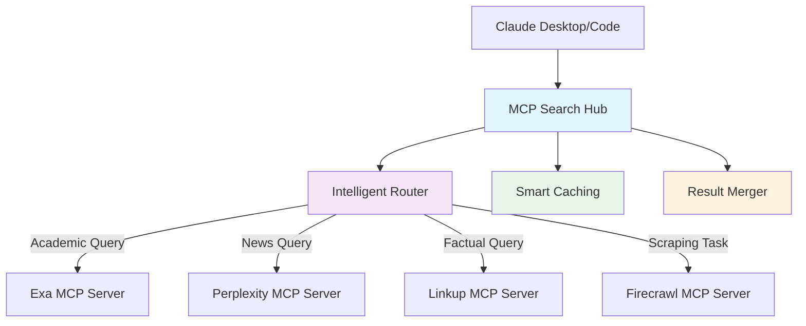
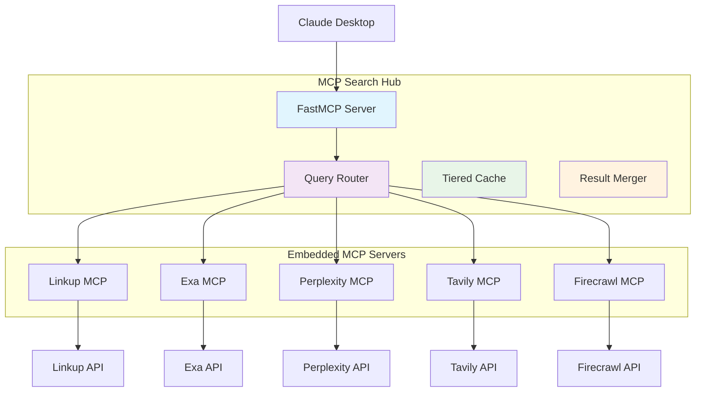

# MCP Search Hub

> 🔍 **Intelligent multi-provider search aggregation server built on FastMCP 2.0**

[](https://opensource.org/licenses/MIT)
[](https://www.python.org/downloads/)
[](https://github.com/fastmcp)

MCP Search Hub embeds official MCP servers from five leading search providers within a unified interface, intelligently routes queries to the most appropriate provider(s), and combines/ranks results for optimal relevance.

## ✨ Key Features

- **🏗️ Unified Interface**: Single MCP server for all search providers
- **🧠 Intelligent Routing**: Automatically selects optimal providers based on query characteristics
- **⚡ Official Provider Integration**: Embeds official MCP servers (Linkup, Exa, Perplexity, Tavily, Firecrawl)
- **💰 Cost Optimization**: 30-45% cost reduction through intelligent provider selection
- **🚀 Zero Maintenance**: Provider updates flow through automatically
- **📊 Smart Result Merging**: Deduplication and multi-factor ranking
- **⚡ Performance Optimized**: Multi-tier caching and parallel execution
- **🔧 Production Ready**: Error handling, rate limiting, monitoring

## 🚀 Quick Start

Get up and running in 5 minutes:

```bash
# 1. Clone and install
git clone https://github.com/BjornMelin/mcp-search-hub
cd mcp-search-hub
uv pip install -r requirements.txt

# 2. Interactive setup (recommended)
python scripts/setup_claude_desktop.py

# 3. Start searching!
# The script will guide you through API key setup and Claude Desktop integration
```

After setup, restart Claude Desktop and ask: *"What MCP tools do you have available?"*

**📖 [Complete Setup Guide](GETTING_STARTED.md)** | **⚡ [Quick Setup Script](scripts/setup_claude_desktop.py)**

## 🎯 Why MCP Search Hub?

### Provider Strengths

Each provider excels in different areas. MCP Search Hub automatically routes queries to leverage these strengths:

| Provider | Strengths | Best For | Accuracy |
|----------|-----------|----------|----------|
| **Linkup** | Factual information, current events | News, facts, real-time data | 91.0% |
| **Exa** | Semantic search, academic content | Research papers, technical docs | 90.0% |
| **Perplexity** | AI-powered analysis, current events | Complex queries, analysis | 86.0% |
| **Tavily** | RAG-optimized results | Retrieval applications | 73.0% |
| **Firecrawl** | Deep content extraction | Web scraping, full content | N/A |

*Accuracy scores from SimpleQA benchmark*

### Architecture Benefits



**Benefits:**
- **Single Integration**: One MCP server instead of five
- **Zero Configuration**: No need to manage multiple servers
- **Automatic Updates**: Provider improvements flow through automatically
- **Cost Efficient**: Intelligent routing reduces unnecessary API calls
- **Quality Results**: Multi-provider consensus improves accuracy

## 📚 Documentation

### For Users
- **[Getting Started](GETTING_STARTED.md)** - Complete setup guide and first steps
- **[Configuration](CONFIGURATION.md)** - Detailed configuration reference
- **[API Reference](API_REFERENCE.md)** - Complete tool and endpoint documentation
- **[Troubleshooting](docs/troubleshooting/common-issues.md)** - Solutions to common problems

### For Developers
- **[Contributing](CONTRIBUTING.md)** - How to contribute to the project
- **[Development](DEVELOPMENT.md)** - Development workflows and practices
- **[Architecture](docs/architecture/overview.md)** - System design and components

### Advanced Topics
- **[Provider Integration](docs/architecture/provider-integration.md)** - How providers are embedded
- **[Caching Strategy](docs/architecture/caching.md)** - Multi-tier caching system
- **[Performance Tuning](docs/deployment/performance.md)** - Optimization strategies

📖 **[Complete Documentation Index](docs/README.md)**

## ⚙️ Installation

### Prerequisites

- **Python 3.10+** (required for FastMCP 2.0)
- **API keys** for desired search providers
- **Node.js 16+** (optional, for provider MCP servers)

### Option 1: Interactive Setup (Recommended)

```bash
git clone https://github.com/BjornMelin/mcp-search-hub
cd mcp-search-hub
python scripts/setup_claude_desktop.py
```

### Option 2: Docker (Production Ready)

```bash
git clone https://github.com/BjornMelin/mcp-search-hub
cd mcp-search-hub
cp .env.example .env  # Edit with your API keys
docker-compose up -d
```

### Option 3: Manual Installation

```bash
git clone https://github.com/BjornMelin/mcp-search-hub
cd mcp-search-hub
python -m venv venv
source venv/bin/activate  # Windows: venv\Scripts\activate
uv pip install -r requirements.txt
cp .env.example .env  # Edit with your API keys
python -m mcp_search_hub.main
```

📖 **[Detailed Installation Guide](GETTING_STARTED.md#installation-methods)**

## 🔑 Configuration

### Minimal Configuration

At minimum, you need API keys for the providers you want to use:

```bash
# Required: At least one provider API key
LINKUP_API_KEY=your_linkup_key
EXA_API_KEY=your_exa_key
PERPLEXITY_API_KEY=your_perplexity_key
TAVILY_API_KEY=your_tavily_key
FIRECRAWL_API_KEY=your_firecrawl_key
```

### Getting API Keys

| Provider | Free Tier | Sign Up |
|----------|-----------|---------|
| **Linkup** | 100 requests/month | [linkup.so](https://linkup.so) |
| **Exa** | 1,000 requests/month | [exa.ai](https://exa.ai) |
| **Perplexity** | $5 credit | [perplexity.ai](https://perplexity.ai) |
| **Tavily** | 1,000 requests/month | [tavily.com](https://tavily.com) |
| **Firecrawl** | 500 requests/month | [firecrawl.dev](https://firecrawl.dev) |

⚙️ **[Complete Configuration Guide](CONFIGURATION.md)**

## 🔍 Usage Examples

### With Claude Desktop

After setup, you can use search tools naturally in Claude Desktop:

```
🧑 Find the latest research papers on quantum computing

🤖 I'll search for the latest quantum computing research papers using multiple academic sources.

[Searches using Exa and Perplexity providers automatically]

Here are the latest research papers on quantum computing:

1. **"Quantum Error Correction with Deep Learning"**
   - Published: Nature Physics, Dec 2024
   - Summary: Novel approach using neural networks...

2. **"Advances in Quantum Algorithms for Machine Learning"**
   - Published: arXiv, Jan 2025
   - Summary: Breakthrough in quantum speedup...
```

### With Python

```python
from mcp.client import Client

client = Client("http://localhost:8000/mcp")

# Automatic provider selection
response = client.invoke("search", {
    "query": "latest developments in artificial intelligence",
    "max_results": 10
})

# Provider-specific search
response = client.invoke("exa_research_papers", {
    "query": "quantum computing breakthroughs 2024",
    "numResults": 15
})

# Advanced search with budget constraints
response = client.invoke("search", {
    "query": "comprehensive market analysis renewable energy",
    "max_results": 20,
    "budget": 0.05,  # Max 5 cents
    "content_type": "COMMERCIAL"
})
```

### HTTP API

```bash
# Basic search
curl -X POST http://localhost:8000/search/combined \
  -H "Content-Type: application/json" \
  -d '{
    "query": "latest AI developments",
    "max_results": 10,
    "advanced": true
  }'

# Provider-specific search
curl -X POST http://localhost:8000/providers/firecrawl/scrape \
  -H "Content-Type: application/json" \
  -d '{
    "url": "https://example.com/article",
    "formats": ["markdown"]
  }'
```

🔧 **[Complete API Reference](API_REFERENCE.md)**

## 🚀 Available Tools

MCP Search Hub provides all tools from embedded provider MCP servers:

### Core Search Tools
- **`search`** - Intelligent multi-provider search with automatic routing
- **`get_provider_info`** - Information about available providers

### Provider-Specific Tools

**Firecrawl** (Web Scraping & Extraction)
- `firecrawl_scrape` - Advanced web scraping
- `firecrawl_search` - Search with content extraction
- `firecrawl_crawl` - Asynchronous site crawling
- `firecrawl_extract` - Structured data extraction

**Exa** (Semantic Search)
- `web_search_exa` - Semantic web search
- `research_paper_search` - Academic papers
- `company_research` - Company information
- `linkedin_search` - LinkedIn profiles

**Perplexity** (AI-Powered Search)
- `perplexity_ask` - AI-powered question answering
- `perplexity_research` - Deep research capabilities

**Linkup** (Real-Time Search)
- `linkup_search_web` - Premium real-time search

**Tavily** (RAG-Optimized)
- `tavily_search` - RAG-optimized search
- `tavily_extract` - Content extraction

🛠️ **[Full Tool Documentation](API_REFERENCE.md#provider-specific-tools)**

## 📊 Performance & Cost

### Response Time Improvements

| Cache Type | Response Time | Improvement |
|------------|---------------|-------------|
| Cache Miss | 800-2000ms | Baseline |
| Redis Hit | 10-50ms | 16-200x faster |
| Memory Hit | 1-5ms | 160-2000x faster |

### Cost Optimization

- **30-45% cost reduction** vs single-provider solutions
- **Intelligent provider selection** based on query characteristics
- **Smart caching** reduces redundant API calls
- **Budget constraints** prevent overspending

## 🏗️ Architecture

MCP Search Hub uses a modular architecture with embedded MCP servers:



### Key Components

1. **FastMCP Server**: Main MCP interface and orchestration
2. **Query Router**: Intelligent provider selection and routing
3. **Embedded MCP Servers**: Official provider integrations
4. **Result Merger**: Combines and ranks results from multiple providers
5. **Tiered Cache**: Memory + Redis caching for performance
6. **Middleware**: Authentication, rate limiting, logging

🏗️ **[Architecture Documentation](docs/architecture/overview.md)**

## 🧪 Development

### Development Setup

```bash
# Clone and setup development environment
git clone https://github.com/BjornMelin/mcp-search-hub
cd mcp-search-hub
python -m venv venv
source venv/bin/activate
uv pip install -r requirements.txt -r requirements-development.txt
pre-commit install
```

### Testing

```bash
# Run all tests
uv run pytest

# Run with coverage
uv run pytest --cov=mcp_search_hub --cov-report=html

# Run specific tests
uv run pytest tests/test_analyzer.py

# Performance benchmarks
python scripts/run_benchmarks.py
```

### Code Quality

```bash
# Format and lint
ruff format .
ruff check --fix .

# Type checking
mypy mcp_search_hub/
```

🛠️ **[Development Guide](DEVELOPMENT.md)** | 🤝 **[Contributing Guide](CONTRIBUTING.md)**

## 🚀 Deployment

### Production Docker Setup

```bash
# Production deployment
cp .env.example .env  # Configure with production settings
docker-compose -f docker-compose.prod.yml up -d

# Health check
curl http://localhost:8000/health

# Monitoring
curl http://localhost:8000/metrics
```

### Environment-Specific Configs

```bash
# Development
docker-compose -f docker-compose.dev.yml up -d

# Production
docker-compose -f docker-compose.prod.yml up -d
```

🚀 **[Deployment Guide](docs/deployment/docker.md)**

## 📈 Monitoring

### Health Endpoints

```bash
# System health
curl http://localhost:8000/health

# Provider status
curl http://localhost:8000/providers

# Performance metrics
curl http://localhost:8000/metrics
```

### Key Metrics

- Request volume and response times
- Provider success rates and errors
- Cache hit rates and performance
- Cost tracking and budget usage

📊 **[Monitoring Guide](docs/deployment/monitoring.md)**

## 🤝 Contributing

We welcome contributions! Here's how to get started:

1. **Fork** the repository
2. **Create** a feature branch
3. **Make** your changes with tests
4. **Submit** a pull request

### Areas for Contribution

- 🐛 **Bug fixes** - Improve stability and reliability
- ✨ **New features** - Add capabilities and integrations
- 📚 **Documentation** - Improve guides and references
- 🧪 **Testing** - Expand test coverage
- 🎨 **Performance** - Optimize speed and efficiency

🤝 **[Contributing Guide](CONTRIBUTING.md)** | 🛠️ **[Development Setup](DEVELOPMENT.md)**

## 📄 License

This project is licensed under the MIT License - see the [LICENSE](LICENSE) file for details.

## 🙏 Acknowledgements

- **[FastMCP](https://github.com/fastmcp)** - The framework powering this server
- **Provider Teams** - For their excellent APIs and official MCP servers:
  - [Linkup](https://linkup.so) ([Python MCP Server](https://github.com/LinkupPlatform/python-mcp-server))
  - [Exa](https://exa.ai) ([Node.js MCP Server](https://github.com/exa-labs/exa-mcp-server))
  - [Perplexity](https://perplexity.ai) ([Node.js MCP Server](https://github.com/ppl-ai/modelcontextprotocol))
  - [Tavily](https://tavily.com) ([Node.js MCP Server](https://github.com/tavily-ai/tavily-mcp))
  - [Firecrawl](https://firecrawl.dev) ([Node.js MCP Server](https://github.com/mendableai/firecrawl-mcp-server))

## 🔗 Links

- **[GitHub Repository](https://github.com/BjornMelin/mcp-search-hub)**
- **[Documentation](docs/README.md)**
- **[Issue Tracker](https://github.com/BjornMelin/mcp-search-hub/issues)**
- **[Releases](https://github.com/BjornMelin/mcp-search-hub/releases)**

---

**Ready to get started?** Follow our [Getting Started Guide](GETTING_STARTED.md) or run the interactive setup:

```bash
python scripts/setup_claude_desktop.py
```