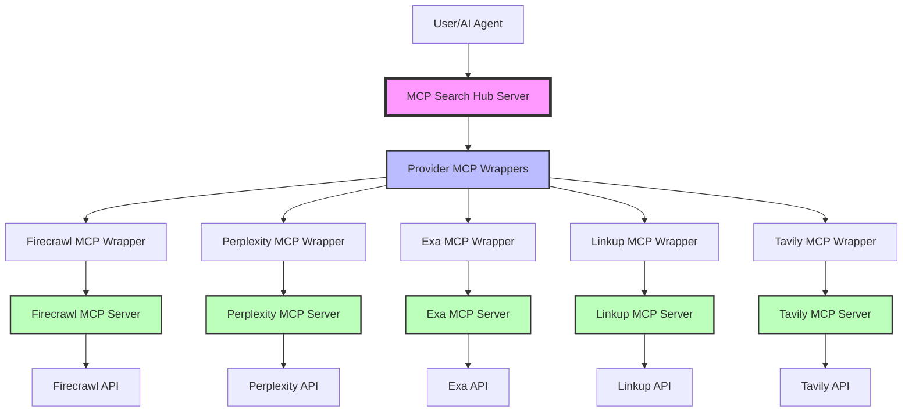

# Architecture Decisions

This document outlines key architectural decisions made in the MCP Search Hub project and the rationale behind them.

## Decision: Embedding All Official Provider MCP Servers

**Date**: January 2025  
**Status**: Implemented for Firecrawl, In Progress for Others  
**Context**: Expanding from initial Firecrawl implementation to all providers

### Background

Initially, we were implementing provider features directly using their APIs. However, we discovered that all major search providers now offer official MCP servers that provide comprehensive access to their capabilities. This led to a strategic decision to embed all provider MCP servers within MCP Search Hub.

### Decision

We decided to **embed all official provider MCP servers within MCP Search Hub** rather than implementing features ourselves using provider APIs directly. This unified approach means:

- Firecrawl MCP server embedding (completed)
- Perplexity MCP server embedding (in progress)
- Exa MCP server embedding (in progress)
- Linkup MCP server embedding (in progress)
- Tavily MCP server embedding (in progress)

### Implementation

Our approach creates a hybrid architecture:

1. Provider MCP servers (Node.js or Python) run as subprocesses
2. We use the MCP Python SDK to connect to them
3. We expose all provider tools through our unified MCP Search Hub interface
4. Users still interact with a single MCP server
5. Each provider's tools are dynamically registered with consistent naming

### Advantages

#### 1. Reduced Maintenance Burden

- Provider maintains and updates their MCP server
- We automatically get bug fixes and new features
- No need to track API changes or update our implementation

#### 2. Feature Completeness

- Official MCP servers expose all available features
- Direct API implementations might miss edge cases or new features
- Providers ensure their MCP servers are comprehensive

#### 3. Better Abstraction

- MCP servers provide standardized interfaces designed for AI agents
- Proper parameter validation and error handling built-in
- Consistent patterns across different providers

#### 4. Higher Reliability

- Official servers are tested and maintained by the providers
- Production-ready code with proper error handling
- Regular updates and security patches

#### 5. Future-Proof Design

- When providers add new capabilities, their MCP server gets updated
- We inherit these features without code changes
- Supports the growing MCP ecosystem

### Trade-offs

#### Disadvantages

- Slight overhead from inter-process communication
- Dependency on Node.js runtime for JavaScript-based servers
- Additional complexity in process management

#### Mitigated By

- Modern systems handle IPC efficiently
- Node.js is widely available and stable
- Process management is well-encapsulated in our wrapper

### Cost-Benefit Analysis

**Using Official MCP Servers**:

- ✅ Less code to maintain
- ✅ Always up-to-date with provider features
- ✅ Better tested and supported
- ✅ Consistent with MCP ecosystem standards
- ❌ Slight IPC overhead
- ❌ Additional runtime dependencies

**Implementing API Directly**:

- ✅ Full control over implementation
- ✅ Single language/runtime
- ❌ Constant maintenance to keep up with API changes
- ❌ Risk of missing features or edge cases
- ❌ More testing burden
- ❌ Duplicating work already done by providers

### Architectural Pattern

### Implementation Details

1. **Provider Wrappers** (e.g., `firecrawl_mcp.py`, `perplexity_mcp.py`):

   - Manage the lifecycle of provider MCP server processes
   - Handle installation verification and setup
   - Provide async interfaces using MCP Python SDK
   - Translate between our provider interface and MCP tools
   - Support both Node.js and Python MCP servers

2. **Tool Registration** (in `server.py`):

   - Dynamically registers all provider tools
   - Maintains consistent naming across providers
   - Handles parameter mapping and validation
   - Provides unified tool documentation

3. **Process Management**:
   - Start provider MCP servers on demand
   - Manage stdio/TCP communication channels
   - Handle graceful shutdown and cleanup
   - Auto-install missing MCP servers

### Future Considerations

This pattern is being applied to all providers:

- [x] Firecrawl MCP server (completed)
- [ ] Perplexity MCP server (in progress) - [ppl-ai/modelcontextprotocol](https://github.com/ppl-ai/modelcontextprotocol)
- [ ] Exa MCP server (in progress) - [exa-labs/exa-mcp-server](https://github.com/exa-labs/exa-mcp-server)
- [ ] Linkup MCP server (in progress) - [LinkupPlatform/python-mcp-server](https://github.com/LinkupPlatform/python-mcp-server)
- [ ] Tavily MCP server (in progress) - [tavily-ai/tavily-mcp](https://github.com/tavily-ai/tavily-mcp)

### Conclusion

Embedding official MCP servers provides the best balance of functionality, maintainability, and future-proofing. While it adds some complexity, the benefits far outweigh the costs, especially as the MCP ecosystem continues to grow.

This architectural decision aligns with our goal of providing a comprehensive, reliable search hub while minimizing maintenance burden and maximizing feature availability.
