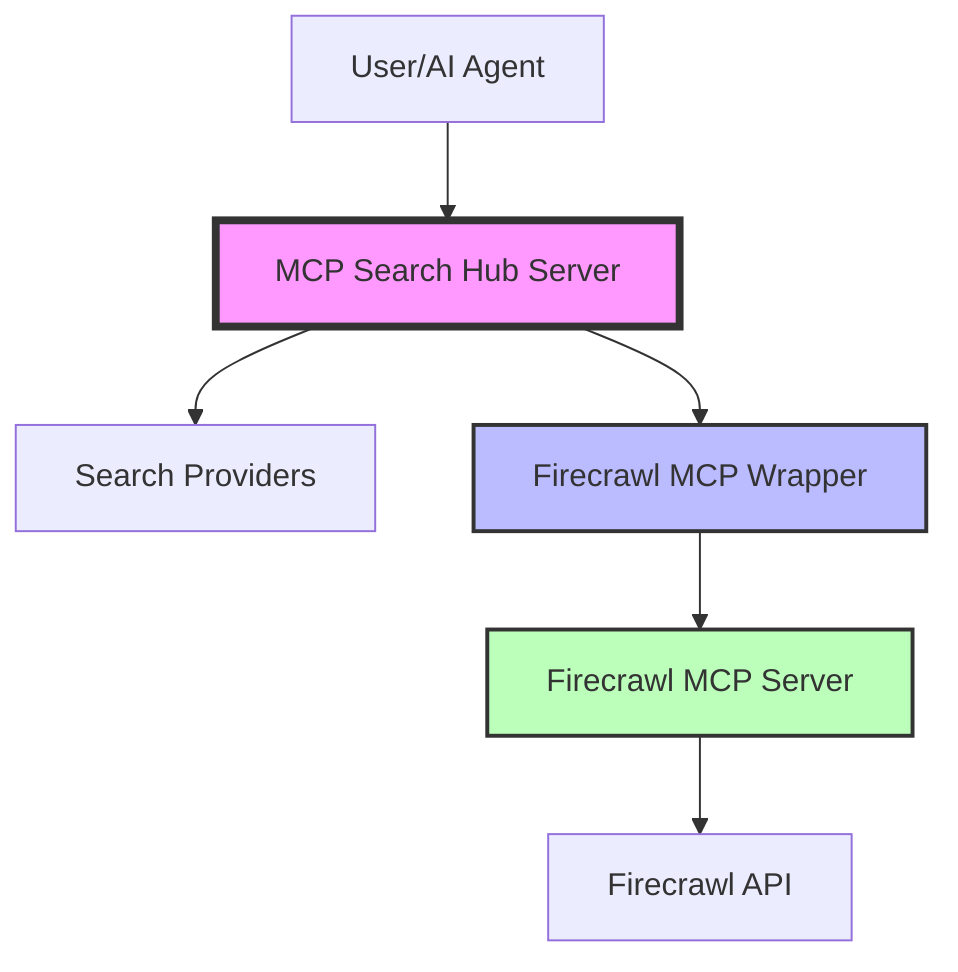

# Architecture Decisions

This document outlines key architectural decisions made in the MCP Search Hub project and the rationale behind them.

## Decision: Embedding Official MCP Servers Instead of Direct API Integration

**Date**: January 2025  
**Status**: Implemented  
**Context**: When implementing Firecrawl provider enhancements

### Background

Initially, we were implementing Firecrawl features directly using their API. However, we discovered that Firecrawl offers an official MCP server that provides comprehensive access to all their capabilities.

### Decision

We decided to **embed the official Firecrawl MCP server within MCP Search Hub** rather than implementing the features ourselves using the Firecrawl API directly.

### Implementation

Our approach creates a hybrid architecture:
1. The Firecrawl MCP server (Node.js) runs as a subprocess
2. We use the MCP Python SDK to connect to it
3. We expose all Firecrawl tools through our unified MCP Search Hub interface
4. Users still interact with a single MCP server

### Advantages

#### 1. Reduced Maintenance Burden
- Provider maintains and updates their MCP server
- We automatically get bug fixes and new features
- No need to track API changes or update our implementation

#### 2. Feature Completeness
- Official MCP servers expose all available features
- Direct API implementations might miss edge cases or new features
- Providers ensure their MCP servers are comprehensive

#### 3. Better Abstraction
- MCP servers provide standardized interfaces designed for AI agents
- Proper parameter validation and error handling built-in
- Consistent patterns across different providers

#### 4. Higher Reliability
- Official servers are tested and maintained by the providers
- Production-ready code with proper error handling
- Regular updates and security patches

#### 5. Future-Proof Design
- When providers add new capabilities, their MCP server gets updated
- We inherit these features without code changes
- Supports the growing MCP ecosystem

### Trade-offs

#### Disadvantages
- Slight overhead from inter-process communication
- Dependency on Node.js runtime for JavaScript-based servers
- Additional complexity in process management

#### Mitigated By
- Modern systems handle IPC efficiently
- Node.js is widely available and stable
- Process management is well-encapsulated in our wrapper

### Cost-Benefit Analysis

**Using Official MCP Servers**:
- ✅ Less code to maintain
- ✅ Always up-to-date with provider features  
- ✅ Better tested and supported
- ✅ Consistent with MCP ecosystem standards
- ❌ Slight IPC overhead
- ❌ Additional runtime dependencies

**Implementing API Directly**:
- ✅ Full control over implementation
- ✅ Single language/runtime
- ❌ Constant maintenance to keep up with API changes
- ❌ Risk of missing features or edge cases
- ❌ More testing burden
- ❌ Duplicating work already done by providers

### Architectural Pattern

### Implementation Details

1. **Provider Wrapper** (`firecrawl_mcp.py`):
   - Manages the lifecycle of the Firecrawl MCP server process
   - Handles installation if not present
   - Provides async interface using MCP Python SDK
   - Translates between our provider interface and MCP tools

2. **Tool Registration** (in `server.py`):
   - Dynamically registers all Firecrawl tools
   - Maintains consistent naming and documentation
   - Handles parameter mapping and validation

3. **Process Management**:
   - Starts Firecrawl MCP server on demand
   - Manages stdio communication
   - Handles graceful shutdown

### Future Considerations

This pattern will be applied to other providers as official MCP servers become available:
- [ ] Perplexity MCP server (when available)
- [ ] Exa MCP server (when available)
- [ ] Linkup MCP server (when available)  
- [ ] Tavily MCP server (when available)

### Conclusion

Embedding official MCP servers provides the best balance of functionality, maintainability, and future-proofing. While it adds some complexity, the benefits far outweigh the costs, especially as the MCP ecosystem continues to grow.

This architectural decision aligns with our goal of providing a comprehensive, reliable search hub while minimizing maintenance burden and maximizing feature availability.