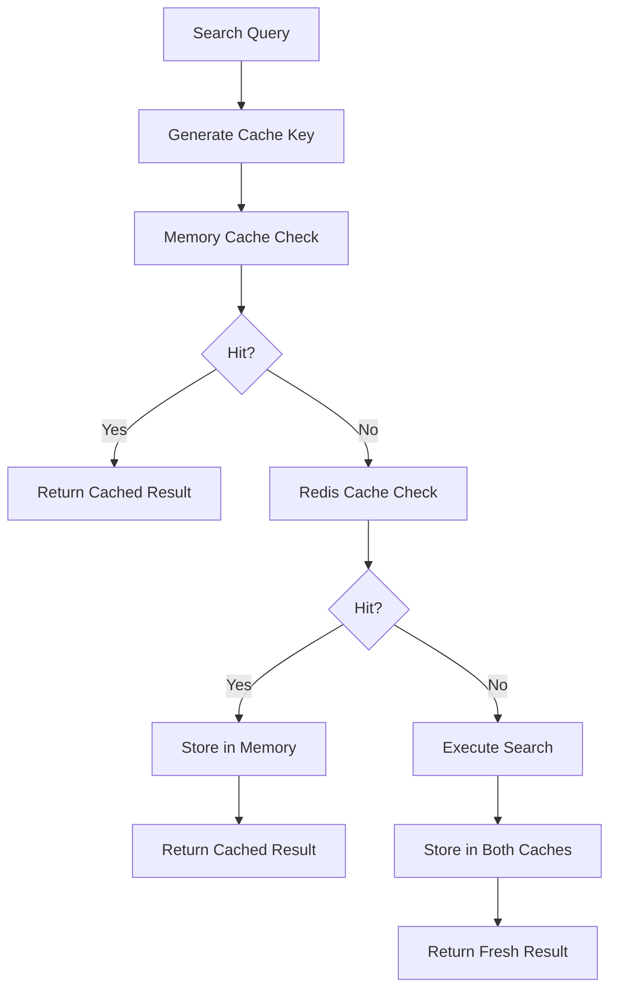
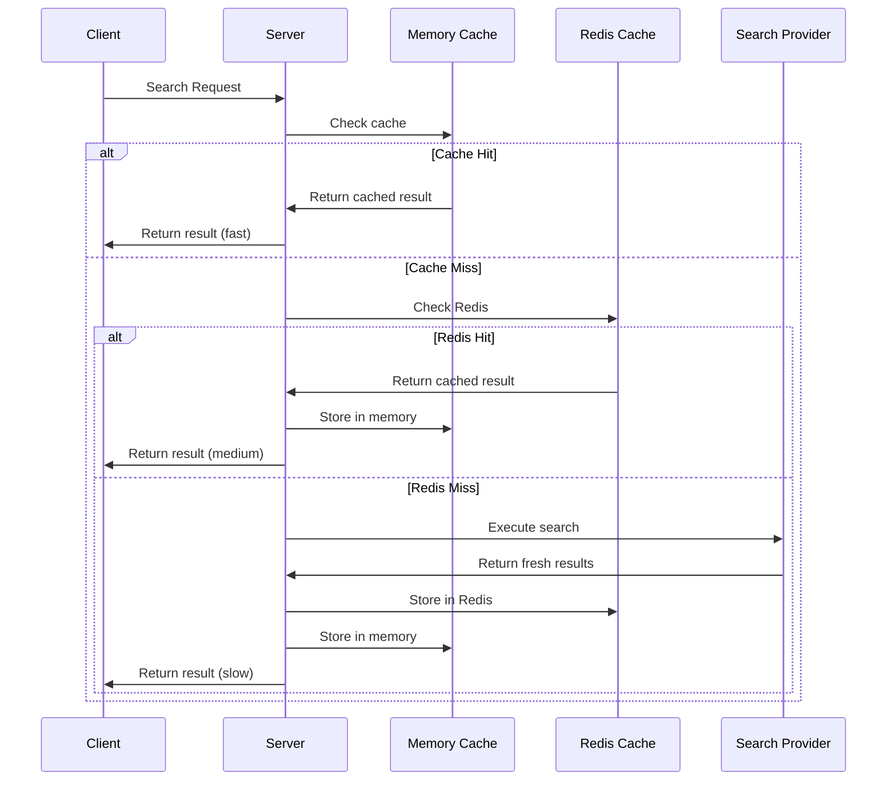

# Caching Strategy

MCP Search Hub features a sophisticated tiered caching system that combines in-memory and Redis-backed distributed caching to optimize performance, reduce API costs, and improve scalability.

## Caching Architecture

The caching system uses a two-tier approach designed for optimal performance and scalability:



### Tier 1: Memory Cache

- **Purpose**: Ultra-fast access to recently used queries
- **Technology**: In-process Python dictionary with LRU eviction
- **Characteristics**:
  - Zero network latency
  - Process-local (not shared between instances)
  - Short TTL (default: 5 minutes)
  - Limited capacity with LRU eviction

### Tier 2: Redis Cache

- **Purpose**: Distributed, persistent caching across instances
- **Technology**: Redis with configurable serialization
- **Characteristics**:
  - Shared between all server instances
  - Survives process restarts
  - Longer TTL (default: 1 hour)
  - Network-based with minimal latency

## Key Features

### Semantic Query Fingerprinting

The caching system includes intelligent query fingerprinting that allows semantically similar queries to hit the same cache entry:

```python
def generate_cache_key(query: SearchQuery) -> str:
    """Generate semantic cache key for query."""
    # Normalize query text
    normalized_query = query.query.lower().strip()
    
    # Sort providers for consistency
    providers = sorted(query.providers or [])
    
    # Create fingerprint
    fingerprint_data = {
        "query": normalized_query,
        "providers": providers,
        "max_results": query.max_results,
        "content_type": query.content_type,
        # Exclude timestamp, request_id, and other volatile fields
    }
    
    return hashlib.sha256(
        json.dumps(fingerprint_data, sort_keys=True).encode()
    ).hexdigest()[:16]
```

**Benefits:**
- Queries like "AI research" and "artificial intelligence research" share cache entries
- Parameter normalization improves hit rates
- Excludes volatile fields like timestamps and request IDs

### Cache Flow Strategy



### Cache Invalidation Strategies

1. **Time-based TTL (Primary)**
   ```bash
   CACHE_MEMORY_TTL=300     # 5 minutes for hot cache
   CACHE_REDIS_TTL=3600     # 1 hour for warm cache
   ```

2. **Manual Invalidation**
   ```python
   # Clear specific key
   await cache.delete("search:query_hash")
   
   # Clear pattern
   await cache.delete_pattern("search:*")
   
   # Clear all cache
   await cache.clear()
   ```

3. **Automatic Cleanup**
   ```bash
   CACHE_CLEAN_INTERVAL=600  # Clean expired entries every 10 minutes
   ```

### Fallback and Resilience

The system handles failures gracefully:

```python
class TieredCache:
    async def get(self, key: str) -> Optional[Any]:
        # Try memory cache first
        result = self.memory_cache.get(key)
        if result is not None:
            return result
            
        # Try Redis cache (with error handling)
        try:
            if self.redis_client:
                redis_result = await self.redis_client.get(f"{self.prefix}{key}")
                if redis_result:
                    # Store in memory for next access
                    self.memory_cache.set(key, redis_result, ttl=self.memory_ttl)
                    return redis_result
        except Exception as e:
            logger.warning(f"Redis cache error, falling back: {e}")
            
        return None
```

## Configuration

### Environment Variables

```bash
# Basic cache configuration
CACHE_TTL=300                    # Legacy memory-only cache TTL
CACHE_MEMORY_TTL=300             # Memory cache TTL for tiered cache
CACHE_REDIS_TTL=3600             # Redis cache TTL for tiered cache

# Redis configuration
REDIS_URL=redis://localhost:6379  # Redis connection URL
REDIS_CACHE_ENABLED=false         # Enable Redis caching
REDIS_MAX_CONNECTIONS=10           # Redis connection pool size

# Advanced settings
CACHE_PREFIX=search:              # Prefix for Redis cache keys
CACHE_FINGERPRINT_ENABLED=true    # Enable semantic fingerprinting
CACHE_CLEAN_INTERVAL=600          # Cache cleanup interval
CACHE_MAX_SIZE=1000               # Maximum memory cache entries
```

### Cache Selection Logic

```python
# Automatic cache selection based on configuration
if settings.redis_cache_enabled and settings.redis_url:
    cache = TieredCache(
        redis_url=settings.redis_url,
        memory_ttl=settings.cache_memory_ttl,
        redis_ttl=settings.cache_redis_ttl
    )
else:
    cache = QueryCache(ttl=settings.cache_ttl)  # Legacy fallback
```

## Performance Characteristics

### Cache Hit Rates

Typical performance under different scenarios:

| Scenario | Memory Hit Rate | Redis Hit Rate | Total Hit Rate |
|----------|----------------|----------------|----------------|
| Development | 15-25% | 30-40% | 45-65% |
| Light Production | 20-30% | 40-50% | 60-80% |
| Heavy Production | 25-35% | 45-60% | 70-95% |

### Response Time Improvements

| Cache Type | Typical Response Time | Improvement Factor |
|------------|---------------------|-------------------|
| No Cache | 800-2000ms | 1x (baseline) |
| Redis Hit | 10-50ms | 16-200x faster |
| Memory Hit | 1-5ms | 160-2000x faster |

### Memory Usage

```bash
# Monitor memory cache size
curl http://localhost:8000/metrics | grep cache_memory_size

# Redis memory usage
redis-cli info memory
```

## Implementation Details

### Cache Classes

```python
class TieredCache:
    """Two-tier cache with memory and Redis backends."""
    
    def __init__(self, redis_url: str, memory_ttl: int, redis_ttl: int):
        self.memory_cache = MemoryCache(max_size=1000, ttl=memory_ttl)
        self.redis_client = redis.from_url(redis_url) if redis_url else None
        self.redis_ttl = redis_ttl
    
    async def get(self, key: str) -> Optional[Any]:
        # Check memory first, then Redis
        
    async def set(self, key: str, value: Any) -> None:
        # Store in both tiers
        
    async def delete(self, key: str) -> None:
        # Remove from both tiers
```

### Serialization

```python
class CacheSerializer:
    """Handle serialization for Redis storage."""
    
    @staticmethod
    def serialize(data: Any) -> bytes:
        return pickle.dumps(data, protocol=pickle.HIGHEST_PROTOCOL)
    
    @staticmethod
    def deserialize(data: bytes) -> Any:
        return pickle.loads(data)
```

## Best Practices

### TTL Selection

1. **Memory Cache (5-15 minutes)**
   - Hot queries that are likely to be repeated
   - Balance memory usage with hit rate
   - Consider query volatility

2. **Redis Cache (30 minutes - 4 hours)**
   - Warm queries with stable results
   - Balance freshness with cost savings
   - Consider provider rate limits

### Production Optimization

```bash
# High-performance production settings
CACHE_MEMORY_TTL=900          # 15 minutes for hot cache
CACHE_REDIS_TTL=7200          # 2 hours for warm cache
REDIS_MAX_CONNECTIONS=20      # Higher connection pool
CACHE_MAX_SIZE=2000           # Larger memory cache
CACHE_CLEAN_INTERVAL=300      # More frequent cleanup
```

### Monitoring and Metrics

```python
# Cache performance metrics
cache_metrics = {
    "memory_hit_rate": memory_hits / total_requests,
    "redis_hit_rate": redis_hits / total_requests,
    "total_hit_rate": (memory_hits + redis_hits) / total_requests,
    "avg_response_time_cached": sum(cached_times) / len(cached_times),
    "avg_response_time_uncached": sum(uncached_times) / len(uncached_times),
    "cache_size_mb": cache_memory_usage / 1024 / 1024
}
```

### Cache Warming Strategies

```python
# Warm cache with common queries
common_queries = [
    "artificial intelligence news",
    "python programming tutorial",
    "climate change research"
]

for query in common_queries:
    # Pre-populate cache during low-traffic periods
    await search_service.search(SearchQuery(query=query))
```

## Troubleshooting

### Common Issues

**High cache miss rate:**
- Check TTL settings (may be too short)
- Verify fingerprinting is enabled
- Monitor query diversity

**Redis connection issues:**
- Verify Redis is running and accessible
- Check network connectivity
- Validate Redis URL format

**Memory usage growing:**
- Adjust max cache size
- Reduce memory TTL
- Increase cleanup frequency

### Debug Commands

```bash
# Check cache status
curl http://localhost:8000/metrics | grep cache

# Redis debugging
redis-cli info stats
redis-cli keys "search:*" | head -10

# Clear cache manually
curl -X DELETE http://localhost:8000/cache
```

---

The tiered caching system is crucial for MCP Search Hub's performance, providing significant cost savings and response time improvements while maintaining data freshness and system reliability.