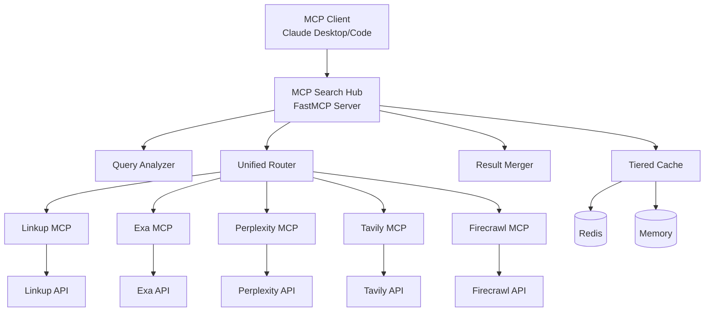
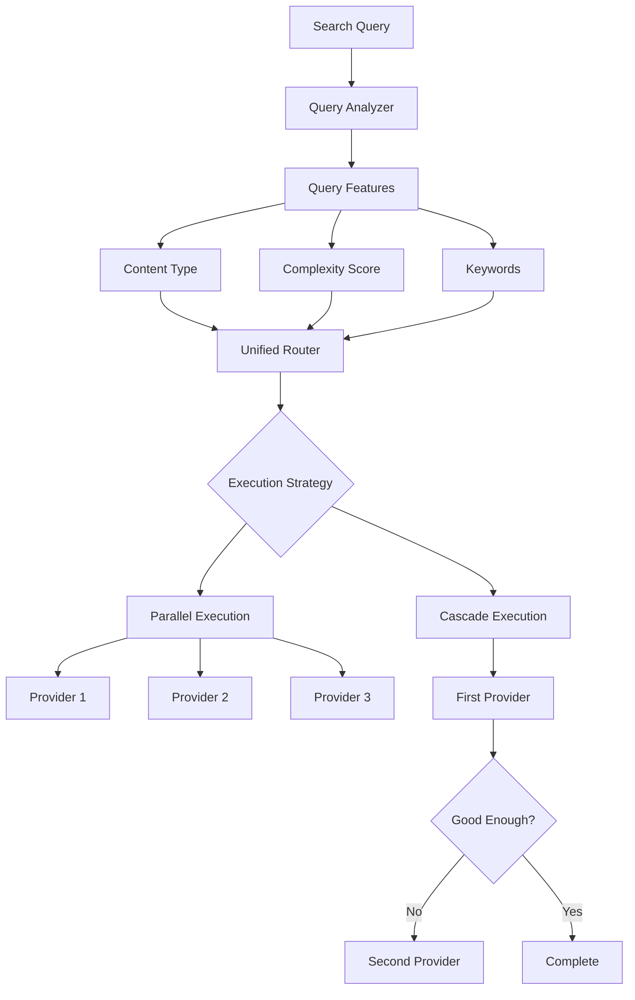
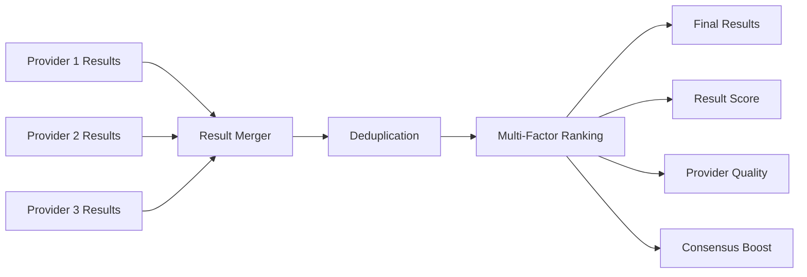
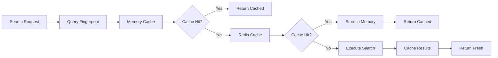

# Architecture Overview

This document provides a high-level overview of MCP Search Hub's architecture, design principles, and key components.

## System Overview

MCP Search Hub is an intelligent search aggregation server that embeds multiple search provider MCP servers within a unified interface. It intelligently routes queries to the most appropriate providers and combines results for optimal relevance.



## Design Principles

### 1. **Embedded MCP Architecture**

Instead of requiring users to configure multiple MCP servers, we embed official provider MCP servers within our unified server:

- **Single Integration Point**: Users connect to one MCP server
- **Provider Abstraction**: Complexity hidden behind unified interface
- **Automatic Updates**: Provider improvements flow through automatically
- **Zero Configuration**: No need to manage multiple server instances

### 2. **Intelligent Query Routing**

Queries are analyzed and routed to the most appropriate providers:

- **Content Type Detection**: Academic, news, technical, commercial content
- **Complexity Analysis**: Simple facts vs. comprehensive research
- **Provider Specialization**: Leverage each provider's strengths
- **Cost Optimization**: Balance quality with budget constraints

### 3. **Configuration-Driven Providers**

Provider behavior is controlled through centralized configuration:

- **Generic Implementation**: One base class handles all MCP interactions
- **Provider Config**: Behavior controlled by `provider_config.py`
- **Easy Extension**: New providers require minimal code
- **Consistent Patterns**: All providers behave predictably

### 4. **Middleware-Based Cross-Cutting Concerns**

Common functionality implemented as composable middleware:

- **Authentication**: API key validation
- **Rate Limiting**: Request throttling
- **Logging**: Structured request/response logging
- **Error Handling**: Consistent error responses
- **Metrics**: Performance and usage tracking

## Core Components

### FastMCP Server Layer

The main server implementation built on FastMCP 2.0:

```python
class SearchServer:
    """Main MCP server orchestrating search operations."""
    
    def __init__(self):
        self.providers = self._initialize_providers()
        self.router = UnifiedRouter(self.providers)
        self.cache = TieredCache()
        self.middleware = MiddlewareStack()
```

**Responsibilities:**
- Tool registration and MCP protocol handling
- Request routing and response formatting
- Provider lifecycle management
- Health monitoring and metrics

### Provider Layer

Search providers are implemented using a generic pattern:

```python
class GenericMCPProvider(SearchProvider):
    """Generic MCP provider implementation."""
    
    def __init__(self, provider_name: str):
        self.config = PROVIDER_CONFIGS[provider_name]
        self.mcp_client = None
    
    async def search(self, query: SearchQuery) -> List[SearchResult]:
        """Execute search via embedded MCP server."""
        return await self._invoke_mcp_tool("search", query.dict())
```

**Provider Types:**
- **LinkupMCPProvider**: Python MCP server for factual search
- **ExaMCPProvider**: Node.js MCP server for semantic search
- **PerplexityMCPProvider**: Node.js MCP server for AI-powered search
- **TavilyMCPProvider**: Node.js MCP server for RAG-optimized search
- **FirecrawlMCPProvider**: Node.js MCP server for web scraping

### Query Routing System

The unified router analyzes queries and selects optimal providers:



**Query Analysis:**
- **Content Type Detection**: FACTUAL, ACADEMIC, NEWS, TECHNICAL, etc.
- **Complexity Scoring**: Simple lookups vs. complex research
- **Keyword Extraction**: Key terms for provider selection
- **Intent Recognition**: Search vs. scrape vs. analysis

**Execution Strategies:**
- **Parallel**: Execute multiple providers simultaneously
- **Cascade**: Execute providers sequentially until satisfied
- **Single**: Route to one optimal provider

### Result Processing Pipeline

Results from multiple providers are merged and ranked:



**Processing Steps:**
1. **Collection**: Gather results from all providers
2. **Normalization**: Convert to common format
3. **Deduplication**: Remove near-duplicate results
4. **Ranking**: Multi-factor scoring algorithm
5. **Filtering**: Apply quality and relevance thresholds

### Caching System

Multi-tier caching for performance optimization:



**Cache Layers:**
- **Memory Cache**: Fast in-memory storage (LRU eviction)
- **Redis Cache**: Persistent shared cache (optional)
- **Semantic Fingerprinting**: Similar queries share cache entries

## Data Flow

### Typical Search Flow

1. **Request Reception**: MCP client sends search request
2. **Query Analysis**: Extract features and determine routing strategy
3. **Provider Selection**: Choose optimal providers based on query characteristics
4. **Cache Check**: Look for cached results using semantic fingerprinting
5. **Provider Execution**: Execute search on selected providers (parallel/cascade)
6. **Result Processing**: Merge, deduplicate, and rank results
7. **Response Formation**: Format unified response with metadata
8. **Cache Storage**: Store results for future similar queries

### Error Handling Flow

1. **Error Detection**: Provider or system error occurs
2. **Error Classification**: Retryable vs. non-retryable
3. **Retry Logic**: Exponential backoff for retryable errors
4. **Fallback**: Route to alternative providers if available
5. **Circuit Breaker**: Temporarily disable failing providers
6. **Error Response**: Return structured error information

## Scalability Considerations

### Horizontal Scaling

- **Stateless Design**: No persistent state in server instances
- **External Cache**: Redis for shared caching across instances
- **Load Balancing**: Standard HTTP load balancer support
- **Provider Isolation**: Failures isolated to specific providers

### Performance Optimization

- **Connection Pooling**: Reuse HTTP connections to providers
- **Concurrent Execution**: Parallel provider requests
- **Smart Caching**: Semantic query matching reduces API calls
- **Circuit Breakers**: Prevent cascade failures

### Resource Management

- **Memory Usage**: Bounded caches with LRU eviction
- **Connection Limits**: Configurable connection pools
- **Rate Limiting**: Per-provider and global rate limits
- **Budget Controls**: Spending limits and cost tracking

## Security Architecture

### Authentication & Authorization

- **API Key Authentication**: Optional API key middleware
- **Provider Credentials**: Secure storage of provider API keys
- **Request Validation**: Input sanitization and validation
- **CORS Configuration**: Cross-origin request controls

### Data Protection

- **No Data Persistence**: Search results not permanently stored
- **Cache Encryption**: Optional Redis encryption
- **Audit Logging**: Request/response logging for compliance
- **Error Sanitization**: No sensitive data in error responses

## Monitoring & Observability

### Health Monitoring

- **Health Endpoints**: `/health` for load balancer checks
- **Provider Status**: Individual provider health tracking
- **Dependency Checks**: Cache and external service status
- **Graceful Degradation**: Continue operating with reduced providers

### Metrics Collection

- **Performance Metrics**: Response times, throughput, errors
- **Business Metrics**: Query types, provider usage, costs
- **System Metrics**: Memory, CPU, connection usage
- **Custom Metrics**: Provider-specific and domain metrics

### Logging Strategy

- **Structured Logging**: JSON format for log aggregation
- **Request Tracing**: Unique request IDs for correlation
- **Performance Logging**: Timing information for optimization
- **Security Logging**: Authentication and authorization events

---

This architecture supports the project's goals of providing a unified, intelligent, and scalable search aggregation service while maintaining simplicity for users and developers.