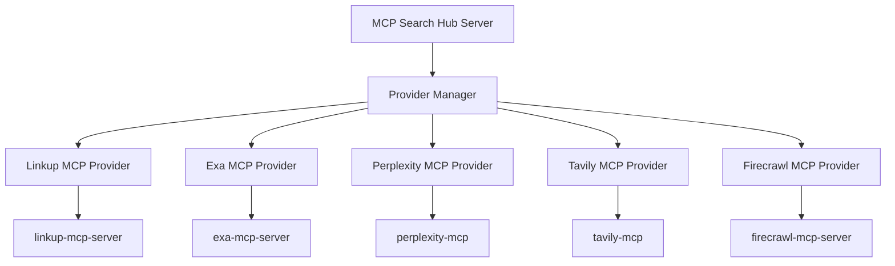

# Provider Architecture

This document explains the provider architecture in MCP Search Hub, including how providers are integrated, managed, and extended.

## Overview

MCP Search Hub uses a plugin-based architecture for search providers. Each provider is wrapped in an MCP (Model Context Protocol) server that exposes standardized tools while maintaining provider-specific capabilities.



## Core Components

### 1. Base Provider Interface

All providers implement the `SearchProvider` interface:

```python
class SearchProvider(BaseModel):
    """Base interface for all search providers."""
    
    name: str
    enabled: bool = True
    api_key: Optional[str] = None
    
    async def search(
        self,
        query: str,
        max_results: int = 10,
        **kwargs
    ) -> List[SearchResult]:
        """Execute a search query."""
        raise NotImplementedError
    
    async def check_status(self) -> Tuple[HealthStatus, str]:
        """Check provider health status."""
        raise NotImplementedError
```

### 2. MCP Provider Wrapper

The `GenericMCPProvider` base class handles MCP server lifecycle:

```python
class GenericMCPProvider(SearchProvider):
    """Generic base class for MCP-based providers."""
    
    async def initialize(self) -> None:
        """Install and start MCP server."""
        # Check/install MCP server
        # Start subprocess
        # Establish MCP connection
    
    async def invoke_tool(
        self,
        tool_name: str,
        arguments: Dict[str, Any]
    ) -> Any:
        """Invoke MCP server tool."""
        # Send tool request
        # Handle response
        # Process errors
```

### 3. Provider-Specific Implementation

Each provider extends the generic base:

```python
class ExaMCPProvider(GenericMCPProvider):
    """Exa-specific MCP provider."""
    
    name = "exa"
    
    def _get_provider_config(self) -> Dict[str, Any]:
        """Exa-specific configuration."""
        return PROVIDER_CONFIG["exa"]
    
    async def search(self, query: str, **kwargs) -> List[SearchResult]:
        """Execute Exa search with specific parameters."""
        # Map generic search to Exa tools
        # Handle Exa-specific features
```

## Provider Lifecycle

### 1. Initialization Phase

```python
# Server startup
server = SearchServer()

# Provider discovery and initialization
for provider_name, provider_class in PROVIDERS.items():
    if provider_enabled(provider_name):
        provider = provider_class(api_key=get_api_key(provider_name))
        await provider.initialize()
        
# Tool registration
for provider in providers:
    tools = await provider.list_tools()
    register_tools(tools)
```

### 2. Request Processing

```python
# Query analysis
features = analyzer.analyze(query)

# Provider selection
selected_providers = router.select_providers(features)

# Parallel execution
results = await asyncio.gather(
    *[provider.search(query) for provider in selected_providers]
)

# Result merging
final_results = merger.merge_results(results)
```

### 3. Cleanup

```python
# Graceful shutdown
for provider in providers:
    await provider.close()
```

## Provider Configuration

### Configuration Structure

```python
PROVIDER_CONFIG = {
    "exa": {
        "display_name": "Exa",
        "install_command": ["npm", "install", "-g", "@modelcontextprotocol/server-exa"],
        "run_command": ["npx", "-y", "@modelcontextprotocol/server-exa"],
        "test_command": ["npx", "-y", "@modelcontextprotocol/server-exa", "--version"],
        "requires_node": True,
        "transport": "stdio",
        "rate_limits": RateLimitConfig(...),
        "budget": BudgetConfig(...),
        "tool_mapping": {
            "search": "exa_search",
            "find_similar": "exa_find_similar"
        }
    }
}
```

### Environment Variables

Each provider uses standardized environment variables:

- `{PROVIDER}_API_KEY` - API authentication
- `{PROVIDER}_ENABLED` - Enable/disable provider
- `{PROVIDER}_TIMEOUT` - Request timeout
- `{PROVIDER}_BASE_URL` - Custom endpoint (if supported)

## Adding New Providers

### Step 1: Define Provider Configuration

Add to `providers/provider_config.py`:

```python
PROVIDER_CONFIG["new_provider"] = {
    "display_name": "New Provider",
    "install_command": [...],
    "run_command": [...],
    "requires_node": True,
    "tool_mapping": {...}
}
```

### Step 2: Create Provider Wrapper

Create `providers/new_provider_mcp.py`:

```python
class NewProviderMCPProvider(GenericMCPProvider):
    name = "new_provider"
    
    def _get_provider_config(self) -> Dict[str, Any]:
        return PROVIDER_CONFIG["new_provider"]
    
    async def search(self, query: str, **kwargs) -> List[SearchResult]:
        # Implement provider-specific search logic
        pass
```

### Step 3: Register Provider

Add to `server.py`:

```python
PROVIDER_CLASSES = {
    "new_provider": NewProviderMCPProvider,
    # ... other providers
}
```

### Step 4: Add Tests

Create comprehensive tests:

```python
# tests/test_new_provider_mcp.py
async def test_new_provider_search():
    provider = NewProviderMCPProvider(api_key="test")
    await provider.initialize()
    
    results = await provider.search("test query")
    assert len(results) > 0
```

## Provider Features

### Rate Limiting

Each provider has configurable rate limits:

```python
rate_limits = RateLimitConfig(
    requests_per_minute=60,
    requests_per_hour=1000,
    concurrent_requests=10
)
```

### Budget Tracking

Cost management per provider:

```python
budget = BudgetConfig(
    default_query_budget=Decimal("0.02"),
    daily_budget=Decimal("10.00"),
    monthly_budget=Decimal("300.00")
)
```

### Error Handling

Standardized error handling across providers:

```python
try:
    results = await provider.search(query)
except ProviderRateLimitError:
    # Handle rate limiting
except ProviderAuthenticationError:
    # Handle auth failures
except ProviderTimeoutError:
    # Handle timeouts
```

## Best Practices

### 1. Provider Independence
- Each provider should be self-contained
- No cross-provider dependencies
- Graceful degradation if providers fail

### 2. Consistent Interfaces
- All providers expose search() method
- Standardized result format
- Common error types

### 3. Performance Optimization
- Parallel provider execution
- Connection pooling
- Response caching

### 4. Monitoring
- Health checks for each provider
- Metrics collection
- Error tracking

## Troubleshooting

### Common Issues

1. **Provider Won't Initialize**
   - Check Node.js/Python installation
   - Verify npm/pip connectivity
   - Check file permissions

2. **Authentication Failures**
   - Verify API key format
   - Check key permissions
   - Confirm key is active

3. **Timeout Errors**
   - Increase provider timeout
   - Check network connectivity
   - Verify provider status

### Debug Mode

Enable debug logging:

```bash
LOG_LEVEL=DEBUG python -m mcp_search_hub.main
```

This will show:
- MCP server stdout/stderr
- Tool invocation details
- Response processing steps