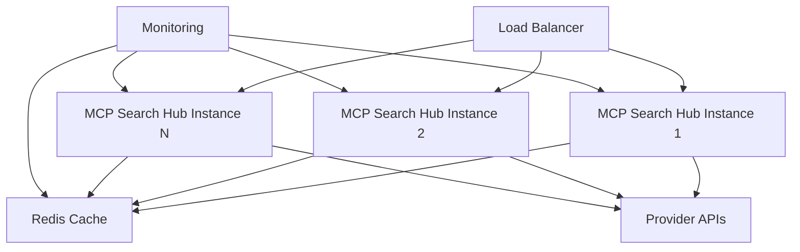

# Production Deployment Guide

This guide covers deploying MCP Search Hub in production environments with high availability, security, and performance.

## Prerequisites

- Linux server (Ubuntu 20.04+ or RHEL 8+)
- Docker 20.10+ and Docker Compose 2.0+
- Valid API keys for enabled providers
- SSL certificates for HTTPS
- Domain name (optional but recommended)

## Production Architecture



## Step 1: System Preparation

### Update System

```bash
# Ubuntu/Debian
sudo apt update && sudo apt upgrade -y
sudo apt install -y docker.io docker-compose nginx certbot python3-certbot-nginx

# RHEL/CentOS
sudo yum update -y
sudo yum install -y docker docker-compose nginx certbot python3-certbot-nginx
```

### Configure System Limits

Edit `/etc/security/limits.conf`:

```
* soft nofile 65535
* hard nofile 65535
* soft nproc 65535
* hard nproc 65535
```

### Configure Sysctl

Edit `/etc/sysctl.conf`:

```
net.core.somaxconn = 65535
net.ipv4.tcp_max_syn_backlog = 65535
net.ipv4.ip_local_port_range = 1024 65535
net.ipv4.tcp_tw_reuse = 1
```

Apply changes:

```bash
sudo sysctl -p
```

## Step 2: Docker Configuration

### Create Docker Network

```bash
docker network create mcp-network
```

### Production Docker Compose

Create `docker-compose.prod.yml`:

```yaml
version: '3.8'

services:
  mcp-search-hub:
    image: mcp-search-hub:latest
    restart: always
    ports:
      - "127.0.0.1:8000:8000"
    environment:
      - LOG_LEVEL=INFO
      - ENVIRONMENT=production
      # Provider API keys from .env file
    env_file:
      - .env.production
    volumes:
      - ./logs:/app/logs
      - ./data:/app/data
    networks:
      - mcp-network
    healthcheck:
      test: ["CMD", "curl", "-f", "http://localhost:8000/health"]
      interval: 30s
      timeout: 10s
      retries: 3
      start_period: 40s
    deploy:
      replicas: 3
      resources:
        limits:
          cpus: '2'
          memory: 4G
        reservations:
          cpus: '1'
          memory: 2G

  redis:
    image: redis:7-alpine
    restart: always
    ports:
      - "127.0.0.1:6379:6379"
    volumes:
      - redis-data:/data
    networks:
      - mcp-network
    command: redis-server --appendonly yes --maxmemory 2gb --maxmemory-policy allkeys-lru

  nginx:
    image: nginx:alpine
    restart: always
    ports:
      - "80:80"
      - "443:443"
    volumes:
      - ./nginx.conf:/etc/nginx/nginx.conf:ro
      - ./ssl:/etc/nginx/ssl:ro
      - nginx-cache:/var/cache/nginx
    networks:
      - mcp-network
    depends_on:
      - mcp-search-hub

volumes:
  redis-data:
  nginx-cache:

networks:
  mcp-network:
    external: true
```

## Step 3: Nginx Configuration

Create `nginx.conf`:

```nginx
events {
    worker_connections 4096;
}

http {
    upstream mcp_backend {
        least_conn;
        server mcp-search-hub:8000 max_fails=3 fail_timeout=30s;
        keepalive 32;
    }

    # Rate limiting
    limit_req_zone $binary_remote_addr zone=api_limit:10m rate=10r/s;
    limit_req_zone $binary_remote_addr zone=search_limit:10m rate=30r/s;

    # Cache configuration
    proxy_cache_path /var/cache/nginx levels=1:2 keys_zone=api_cache:10m max_size=1g inactive=60m;

    server {
        listen 80;
        server_name your-domain.com;
        return 301 https://$server_name$request_uri;
    }

    server {
        listen 443 ssl http2;
        server_name your-domain.com;

        ssl_certificate /etc/nginx/ssl/cert.pem;
        ssl_certificate_key /etc/nginx/ssl/key.pem;
        ssl_protocols TLSv1.2 TLSv1.3;
        ssl_ciphers HIGH:!aNULL:!MD5;

        # Security headers
        add_header X-Frame-Options "SAMEORIGIN" always;
        add_header X-Content-Type-Options "nosniff" always;
        add_header X-XSS-Protection "1; mode=block" always;

        # API endpoints
        location /api/ {
            limit_req zone=api_limit burst=20 nodelay;
            
            proxy_pass http://mcp_backend;
            proxy_http_version 1.1;
            proxy_set_header Upgrade $http_upgrade;
            proxy_set_header Connection "upgrade";
            proxy_set_header Host $host;
            proxy_set_header X-Real-IP $remote_addr;
            proxy_set_header X-Forwarded-For $proxy_add_x_forwarded_for;
            proxy_set_header X-Forwarded-Proto $scheme;
            
            proxy_connect_timeout 60s;
            proxy_send_timeout 60s;
            proxy_read_timeout 60s;
        }

        # Search endpoint with caching
        location /search/ {
            limit_req zone=search_limit burst=50 nodelay;
            
            proxy_cache api_cache;
            proxy_cache_valid 200 5m;
            proxy_cache_methods GET POST;
            proxy_cache_key "$request_method$request_uri$request_body";
            
            proxy_pass http://mcp_backend;
            proxy_http_version 1.1;
            proxy_set_header Host $host;
            proxy_set_header X-Real-IP $remote_addr;
        }

        # Health check endpoint
        location /health {
            proxy_pass http://mcp_backend;
            access_log off;
        }

        # Metrics endpoint (restrict access)
        location /metrics {
            allow 10.0.0.0/8;
            deny all;
            proxy_pass http://mcp_backend;
        }
    }
}
```

## Step 4: Environment Configuration

Create `.env.production`:

```bash
# Server Configuration
HOST=0.0.0.0
PORT=8000
LOG_LEVEL=INFO
ENVIRONMENT=production

# Redis Configuration
REDIS_URL=redis://redis:6379
REDIS_CACHE_ENABLED=true
CACHE_TTL=300
CACHE_PREFIX=mcp:

# Provider API Keys
LINKUP_API_KEY=your_production_key
EXA_API_KEY=your_production_key
PERPLEXITY_API_KEY=your_production_key
TAVILY_API_KEY=your_production_key
FIRECRAWL_API_KEY=your_production_key

# Provider Settings
LINKUP_ENABLED=true
EXA_ENABLED=true
PERPLEXITY_ENABLED=true
TAVILY_ENABLED=true
FIRECRAWL_ENABLED=true

# Security
API_KEY_REQUIRED=true
ALLOWED_ORIGINS=https://your-domain.com
RATE_LIMIT_ENABLED=true

# Performance
MAX_WORKERS=4
REQUEST_TIMEOUT=30
CONNECTION_POOL_SIZE=100
```

## Step 5: SSL Certificate Setup

### Using Let's Encrypt

```bash
sudo certbot --nginx -d your-domain.com
```

### Using Custom Certificates

```bash
mkdir -p ssl
cp /path/to/cert.pem ssl/
cp /path/to/key.pem ssl/
chmod 600 ssl/*
```

## Step 6: Deployment

### Build and Deploy

```bash
# Build production image
docker build -t mcp-search-hub:latest .

# Start services
docker-compose -f docker-compose.prod.yml up -d

# Check status
docker-compose -f docker-compose.prod.yml ps

# View logs
docker-compose -f docker-compose.prod.yml logs -f
```

## Step 7: Monitoring Setup

### Prometheus Configuration

Create `prometheus.yml`:

```yaml
global:
  scrape_interval: 15s

scrape_configs:
  - job_name: 'mcp-search-hub'
    static_configs:
      - targets: ['mcp-search-hub:8000']
    metrics_path: '/metrics'
```

### Grafana Dashboard

Import the MCP Search Hub dashboard:
1. Access Grafana at http://your-server:3000
2. Import dashboard ID: [TBD]
3. Select Prometheus data source

## Step 8: Backup Configuration

### Automated Backups

Create `/etc/cron.d/mcp-backup`:

```cron
0 2 * * * root /opt/mcp-search-hub/scripts/backup.sh
```

Create `scripts/backup.sh`:

```bash
#!/bin/bash
BACKUP_DIR="/backups/mcp-search-hub"
DATE=$(date +%Y%m%d_%H%M%S)

# Backup Redis
docker exec redis redis-cli BGSAVE
sleep 5
docker cp redis:/data/dump.rdb $BACKUP_DIR/redis_$DATE.rdb

# Backup configuration
cp .env.production $BACKUP_DIR/env_$DATE
cp docker-compose.prod.yml $BACKUP_DIR/compose_$DATE.yml

# Clean old backups (keep 30 days)
find $BACKUP_DIR -name "*.rdb" -mtime +30 -delete
```

## Step 9: Security Hardening

### Firewall Rules

```bash
# Allow SSH, HTTP, HTTPS
sudo ufw allow 22/tcp
sudo ufw allow 80/tcp
sudo ufw allow 443/tcp

# Allow monitoring from specific IPs
sudo ufw allow from 10.0.0.0/8 to any port 9090  # Prometheus
sudo ufw allow from 10.0.0.0/8 to any port 3000  # Grafana

# Enable firewall
sudo ufw enable
```

### API Key Rotation

Implement regular API key rotation:

```bash
# Monthly rotation script
#!/bin/bash
# Notify about upcoming rotation
# Update keys in secure vault
# Deploy new configuration
# Verify all providers working
```

## Step 10: Performance Tuning

### Docker Performance

Edit `/etc/docker/daemon.json`:

```json
{
  "log-driver": "json-file",
  "log-opts": {
    "max-size": "100m",
    "max-file": "5"
  },
  "storage-driver": "overlay2",
  "storage-opts": [
    "overlay2.override_kernel_check=true"
  ]
}
```

### Application Tuning

```bash
# In .env.production
ASYNCIO_POOL_SIZE=50
CONNECTION_TIMEOUT=30
KEEPALIVE_TIMEOUT=300
QUERY_CACHE_SIZE=10000
RESULT_CACHE_TTL=300
```

## Maintenance

### Health Checks

```bash
# Check overall health
curl https://your-domain.com/health

# Check specific provider
curl https://your-domain.com/health?provider=exa

# View metrics
curl https://your-domain.com/metrics
```

### Log Rotation

Configure logrotate in `/etc/logrotate.d/mcp-search-hub`:

```
/opt/mcp-search-hub/logs/*.log {
    daily
    rotate 14
    compress
    delaycompress
    notifempty
    create 0640 docker docker
    sharedscripts
    postrotate
        docker-compose -f /opt/mcp-search-hub/docker-compose.prod.yml kill -s USR1 mcp-search-hub
    endscript
}
```

## Troubleshooting

### Common Issues

1. **High Memory Usage**
   - Check Redis memory usage
   - Adjust cache TTL
   - Monitor provider connections

2. **Slow Response Times**
   - Check provider status
   - Review nginx cache hit rates
   - Monitor network latency

3. **Provider Failures**
   - Verify API keys are valid
   - Check rate limits
   - Review provider-specific logs

### Emergency Procedures

```bash
# Restart all services
docker-compose -f docker-compose.prod.yml restart

# Clear Redis cache
docker exec redis redis-cli FLUSHALL

# Emergency shutdown
docker-compose -f docker-compose.prod.yml down

# View real-time logs
docker-compose -f docker-compose.prod.yml logs -f --tail=100
```

## Scaling Considerations

### Horizontal Scaling

- Add more MCP Search Hub instances
- Use external Redis cluster
- Implement session affinity if needed

### Vertical Scaling

- Increase container resource limits
- Optimize provider concurrency
- Tune connection pools

### Geographic Distribution

- Deploy in multiple regions
- Use CDN for static assets
- Implement geo-routing